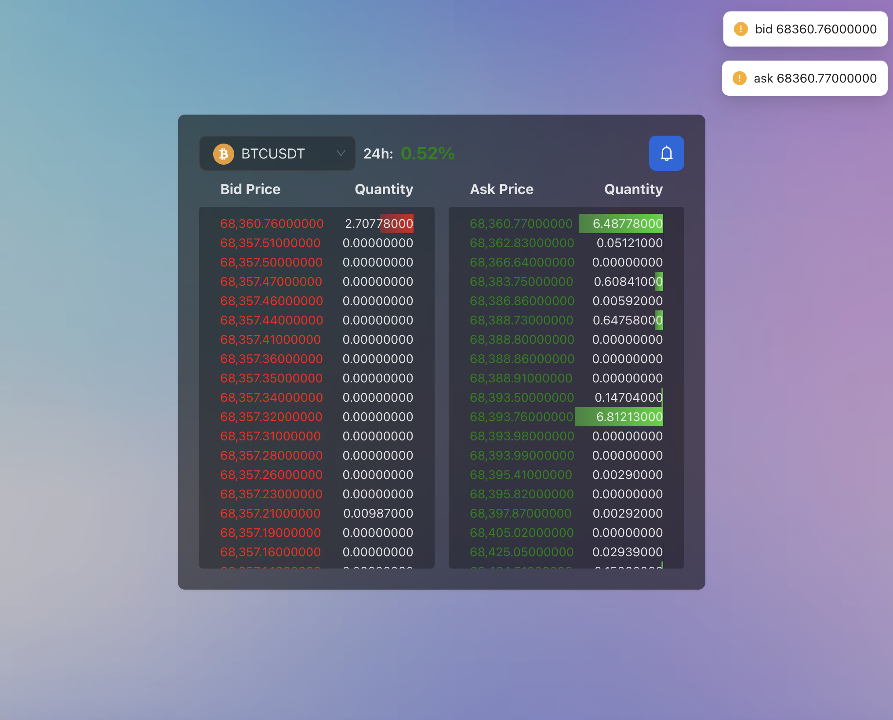

### Features and How It Works
-   **Select and Search Symbol**: With the corresponding icon, users can select and search for symbols. When a new symbol is chosen, a socket call is made to the server via the `/symbol` pipeline so the server can save and stream the correct symbol's bid/ask data.
-   **Bid/Ask Data Table**: Bid prices are displayed in red and ask prices in green. The data is retrieved in real-time from the server through the `/orderBook` pipeline. The server obtains this data from the Binance Websocket at `wss://stream.binance.com:9443/ws/${symbol}@depth`.
-   **Token Price 24h Change**: Data is fetched from the API `https://api.binance.com/api/v3/ticker/24hr?symbol=${symbol}` every 2 seconds. This data is then sent to the `/symbol/24hr` pipeline. The weight of this api is 2 and binance's limit rate is 120/minute => It will work well.
-   **Token Price Alerts**: Alert conditions are saved on the server through the `conditions` pipeline. When streaming bid/ask data from Binance, the server checks these conditions and triggers an event back to the client via the `/alert` pipeline if conditions are met. Currently, I am sending random data instead of implementing real logic.

### Refferences
- Get bid/ask: `wss://stream.binance.com:9443/ws/${symbol}@depth`
- Get symbol list: `https://api.binance.com/api/v3/exchangeInfo`
- Get 24h change: `https://api.binance.com/api/v3/ticker/24hr?symbol=${symbol}`

###

